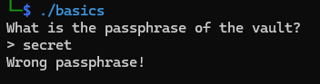
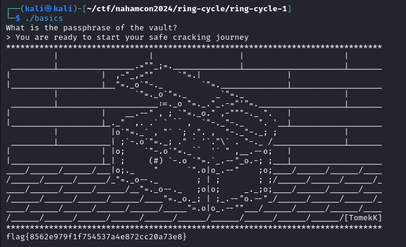

For this challenge, we need to provide the correct phrase to retrieve the flag.



I decompiled the binary in ghidra and included the parts that were interesting.

```c
undefined8 main(EVP_PKEY_CTX *param_1)

{
  char check_flag;
  FILE *__stream;
  undefined8 uVar1;
  size_t file_len;
  char *__format;
  long in_FS_OFFSET;
  int i;
  byte flagBuffer [16];
  uchar user_input [56];
  long canary;

  canary = *(long *)(in_FS_OFFSET + 0x28);
  init(param_1);
  printf("What is the passphrase of the vault?\n> ");
  fgets((char *)user_input,0x32,stdin);
  check_flag = check(user_input);
  if (check_flag == '\0') {
    puts("Wrong passphrase!");
  }
  else {
    __stream = fopen("basics.txt","r");
    if (__stream == (FILE *)0x0) {
      uVar1 = 0xffffffff;
      goto LAB_001016f3;
    }
    fseek(__stream,0,2);
    file_len = ftell(__stream);
    fseek(__stream,0,0);
    __format = (char *)calloc(file_len,1);
    if (__format == (char *)0x0) {
      uVar1 = 0xffffffff;
      goto LAB_001016f3;
    }
    fread(__format,1,file_len,__stream);
    fclose(__stream);
    printf(__format);
    file_len = strlen((char *)user_input);
    MD5(user_input,file_len,flagBuffer);
    printf("flag{");
    for (i = 0; i < 0x10; i = i + 1) {
      printf("%02x",(ulong)flagBuffer[i]);
    }
    puts("}");
  }
  uVar1 = 0;
LAB_001016f3:
  if (canary != *(long *)(in_FS_OFFSET + 0x28)) {
                    /* WARNING: Subroutine does not return */
    __stack_chk_fail();
  }
  return uVar1;
}
```
In `main`, it basically reads in our input and passes it to `check`, which will print the flag if it's true.


```c
bool check(long user_input)

{
  long lVar1;
  int iVar2;
  long in_FS_OFFSET;
  int i;
  int j;
  int k;
  char array [64];
  char local_48 [50];
  char c;

  lVar1 = *(long *)(in_FS_OFFSET + 0x28);
  for (i = 0; i < 0x19; i = i + 1) {
    c = *(char *)(user_input + i);
    array[i] = *(char *)(user_input + (long)(0x32 - i) + -1);
    array[0x31 - i] = c;
  }
  for (j = 0; j < 0x32; j = j + 1) {
    c = array[j];
    array[j] = array[j + 1];
    array[j + 1] = c;
  }
  array[49] = 0;
  for (k = 0; k < 0x30; k = k + 2) {
    c = array[k];
    array[k] = array[k + 1];
    array[k + 1] = c;
  }
  local_48[0] = 'e';
  local_48[1] = 'y';
  local_48[2] = 'r';
  local_48[3] = 'n';
  local_48[4] = 'o';
  local_48[5] = 'u';
  local_48[6] = ' ';
  local_48[7] = 'j';
  local_48[8] = 'n';
  local_48[9] = 'g';
  local_48[10] = 'k';
  local_48[11] = 'i';
  local_48[12] = 'a';
  local_48[13] = 'c';
  local_48[14] = 'c';
  local_48[15] = 'r';
  local_48[16] = 'e';
  local_48[17] = ' ';
  local_48[18] = 'a';
  local_48[19] = 'f';
  local_48[20] = ' ';
  local_48[21] = 's';
  local_48[22] = 'u';
  local_48[23] = 'r';
  local_48[24] = 'y';
  local_48[25] = 'o';
  local_48[26] = 't';
  local_48[27] = ' ';
  local_48[28] = 'a';
  local_48[29] = 'r';
  local_48[30] = 's';
  local_48[31] = 't';
  local_48[32] = 'o';
  local_48[33] = ' ';
  local_48[34] = ' ';
  local_48[35] = 't';
  local_48[36] = 'd';
  local_48[37] = 'y';
  local_48[38] = 'e';
  local_48[39] = 'a';
  local_48[40] = ' ';
  local_48[41] = 'r';
  local_48[42] = 'r';
  local_48[43] = 'e';
  local_48[44] = ' ';
  local_48[45] = 'a';
  local_48[46] = 'o';
  local_48[47] = 'u';
  local_48[48] = 'Y';
  local_48[49] = '\0';
  iVar2 = strcmp(array,local_48);
  if (lVar1 != *(long *)(in_FS_OFFSET + 0x28)) {
                    /* WARNING: Subroutine does not return */
    __stack_chk_fail();
  }
  return iVar2 == 0;
}
```

In `check`, our user input is passed through 3 `for` loops that perform some transformations on the string, and is finally `strcmp` with `local_48`.
So, for this challenge we need to reverse the `for` loops, and by applying the transformations to the string in `local_48`, we should get the expected string for `check`.

```c
  for (i = 0; i < 0x19; i = i + 1) {
    c = *(char *)(user_input + i);
    array[i] = *(char *)(user_input + (long)(0x32 - i) + -1);
    array[0x31 - i] = c;
  }
```
The first loop swaps the front and back characters around the *midpoint*.
For example, if we have the string `deadbeef`, the loop will result in `feebdaed`.

```c
  for (j = 0; j < 0x32; j = j + 1) {
    c = array[j];
    array[j] = array[j + 1];
    array[j + 1] = c;
  }
```
The second loop shifts all the characters to the left, and the first character will be at the last position in the array.

```c
  array[49] = 0;
  for (k = 0; k < 0x30; k = k + 2) {
    c = array[k];
    array[k] = array[k + 1];
    array[k + 1] = c;
  }
```
The last character is the null character.
Finally, the last loop swaps each pair of characters.

## Solution

*Sorry for the ugly code. You could've probably wrote something simpler in python :(*

```c
#include <stdio.h>
#include <string.h>

void reverse(char* array) {
	int i, j, k;
	char c;

	for (k = 46; k >= 0; k -= 2) {
	    c = array[k];
	    array[k] = array[k + 1];
	    array[k + 1] = c;
	}

	for (j = 48; j >= 0; j--) {
	    c = array[j];
	    array[j] = array[j + 1];
	    array[j + 1] = c;
	}

	for (i = 0; i < 25; i++) {
		c = array[i];
		array[i] = array[49-i];
		array[49-i] = c;
	}

	printf("'%s'\n", array);
}


int main() {
	char input[50];
	input[0] = 'e';
	input[1] = 'y';
	input[2] = 'r';
	input[3] = 'n';
	input[4] = 'o';
	input[5] = 'u';
	input[6] = ' ';
	input[7] = 'j';
	input[8] = 'n';
	input[9] = 'g';
	input[10] = 'k';
	input[11] = 'i';
	input[12] = 'a';
	input[13] = 'c';
	input[14] = 'c';
	input[15] = 'r';
	input[16] = 'e';
	input[17] = ' ';
	input[18] = 'a';
	input[19] = 'f';
	input[20] = ' ';
	input[21] = 's';
	input[22] = 'u';
	input[23] = 'r';
	input[24] = 'y';
	input[25] = 'o';
	input[26] = 't';
	input[27] = ' ';
	input[28] = 'a';
	input[29] = 'r';
	input[30] = 's';
	input[31] = 't';
	input[32] = 'o';
	input[33] = ' ';
	input[34] = ' ';
	input[35] = 't';
	input[36] = 'd';
	input[37] = 'y';
	input[38] = 'e';
	input[39] = 'a';
	input[40] = ' ';
	input[41] = 'r';
	input[42] = 'r';
	input[43] = 'e';
	input[44] = ' ';
	input[45] = 'a';
	input[46] = 'o';
	input[47] = 'u';
	input[48] = 'Y';
	input[49] = '\0';
	reverse(input);
    return 0;
}

```

This will give us the phrase:
> You are ready to start your safe cracking journey

Enter this phrase, and we get the flag.


Flag: `flag{8562e979f1f754537a4e872cc20a73e8}`