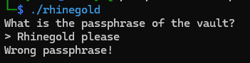
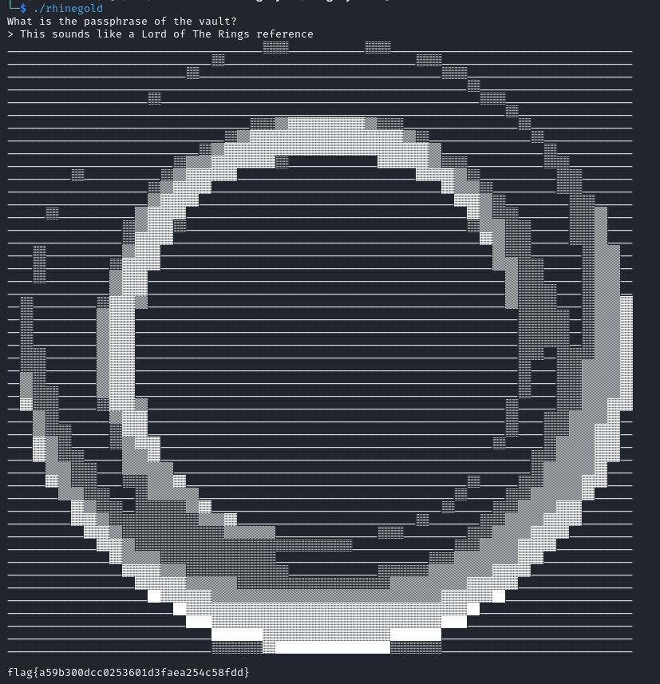

This challenge is similar to Ring Cycle 1, where we need to enter the correct passphrase to get the flag.



Decompiling the binary in ghidra, we get two functions of interest, `main` and `check`:

`main`:
```c
undefined8 main(EVP_PKEY_CTX *param_1)

{
  char cVar1;
  FILE *__stream;
  undefined8 uVar2;
  size_t stream_len;
  char *__format;
  long in_FS_OFFSET;
  int local_74;
  byte local_58 [16];
  uchar input_buffer [46];
  undefined local_1a;
  long canary;

  canary = *(long *)(in_FS_OFFSET + 0x28);
  init(param_1);
  printf("What is the passphrase of the vault?\n> ");
  fgets((char *)input_buffer,0x2f,stdin);
  local_1a = 0;
  cVar1 = check(input_buffer);
  if (cVar1 == '\0') {
    puts("Wrong passphrase!");
  }
  else {
    __stream = fopen("rhinegold.txt","r");
    if (__stream == (FILE *)0x0) {
      uVar2 = 0xffffffff;
      goto LAB_001016b8;
    }
    fseek(__stream,0,2);
    stream_len = ftell(__stream);
    fseek(__stream,0,0);
    __format = (char *)calloc(stream_len,1);
    if (__format == (char *)0x0) {
      uVar2 = 0xffffffff;
      goto LAB_001016b8;
    }
    fread(__format,1,stream_len,__stream);
    fclose(__stream);
    printf(__format);
    stream_len = strlen((char *)input_buffer);
    MD5(input_buffer,stream_len,local_58);
    printf("flag{");
    for (local_74 = 0; local_74 < 0x10; local_74 = local_74 + 1) {
      printf("%02x",(ulong)local_58[local_74]);
    }
    puts("}");
  }
  uVar2 = 0;
LAB_001016b8:
  if (canary != *(long *)(in_FS_OFFSET + 0x28)) {
                    /* WARNING: Subroutine does not return */
    __stack_chk_fail();
  }
  return uVar2;
}
```
`main` takes in user input and passes it to the `check` function.
If `check` does not return a null character, it prints out the flag.

`check`:
```c
undefined8 check(long input_string)

{
  int random_number;
  long seed;
  undefined8 is_checked;
  long in_FS_OFFSET;
  int j;
  long i;
  char local_4d [5];
  char compared_string [47];
  undefined c;
  long canary;

  canary = *(long *)(in_FS_OFFSET + 0x28);
  local_4d[0] = 'T';
  local_4d[1] = 'I';
  local_4d[2] = 'M';
  local_4d[3] = 'E';
  local_4d[4] = '\0';
  seed = strtol(local_4d,(char **)0x0,10);
  srand((uint)seed);
  for (i = 45; i != 0; i = i + -1) {
    random_number = rand();
    c = *(undefined *)(i + input_string);
    *(undefined *)(i + input_string) = *(undefined *)(random_number % 46 + input_string);
    *(undefined *)(random_number % 46 + input_string) = c;
  }
  compared_string[0] = 'c';
  compared_string[1] = 'i';
  compared_string[2] = 'o';
  compared_string[3] = 'e';
  compared_string[4] = 'r';
  compared_string[5] = 'o';
  compared_string[6] = 's';
  compared_string[7] = 'g';
  compared_string[8] = 'a';
  compared_string[9] = 'e';
  compared_string[10] = 'n';
  compared_string[11] = 'e';
  compared_string[12] = 's';
  compared_string[13] = 's';
  compared_string[14] = 'T';
  compared_string[15] = ' ';
  compared_string[16] = ' ';
  compared_string[17] = ' ';
  compared_string[18] = 'n';
  compared_string[19] = 's';
  compared_string[20] = ' ';
  compared_string[21] = 'k';
  compared_string[22] = ' ';
  compared_string[23] = 'u';
  compared_string[24] = 'r';
  compared_string[25] = 'e';
  compared_string[26] = 'l';
  compared_string[27] = 'h';
  compared_string[28] = ' ';
  compared_string[29] = 'o';
  compared_string[30] = 'L';
  compared_string[31] = 'd';
  compared_string[32] = 'T';
  compared_string[33] = 'i';
  compared_string[34] = 'e';
  compared_string[35] = ' ';
  compared_string[36] = 'h';
  compared_string[37] = 'e';
  compared_string[38] = 'r';
  compared_string[39] = 'i';
  compared_string[40] = ' ';
  compared_string[41] = 'n';
  compared_string[42] = 'f';
  compared_string[43] = 'd';
  compared_string[44] = 'f';
  compared_string[45] = 'R';
  compared_string[46] = '\0';
  j = 0;
  do {
    if (0x2e < j) {
      is_checked = 1;
LAB_001014e2:
      if (canary != *(long *)(in_FS_OFFSET + 0x28)) {
                    /* WARNING: Subroutine does not return */
        __stack_chk_fail();
      }
      return is_checked;
    }
    if (*(char *)(input_string + j) != compared_string[j]) {
      is_checked = 0;
      goto LAB_001014e2;
    }
    j = j + 1;
  } while( true );
}
```
We see that it's similiar to the previous challenge, where our input string is shuffled and finally `strcmp` with another string.

```c
local_4d[0] = 'T';
local_4d[1] = 'I';
local_4d[2] = 'M';
local_4d[3] = 'E';
local_4d[4] = '\0';
seed = strtol(local_4d,(char **)0x0,10);
srand((uint)seed);
```
The seed is generated from `strtol`, where `local_4d` is passed.
`strtol` converts a string to longs, but because our string here is `TIME\0`, there are no numbers to be converted, so `strtol` will return 0.
Effectively, this means that our seed is 0, and with `srand(0)`, we can reproduce the same random numbers.

```c
for (i = 45; i != 0; i = i + -1) {
    random_number = rand();
    c = *(undefined *)(i + input_string);
    *(undefined *)(i + input_string) = *(undefined *)(random_number % 46 + input_string);
    *(undefined *)(random_number % 46 + input_string) = c;
}
```
The for loop starts from the end of the string, and shuffles the characters.
Here a random number is generated and modulo by 46 which returns an index within the string.
Then the current ith character is swapped with the random number.
At the end of the loop, the entire string is shuffled.

Our goal here is find a string that when shuffled, will be equal to `compared_string`.

## Solution

To solve this, we can brute force each alphabet character to build the expected string.
Given our initial string is `abcdefghijklmnopqrstuvwxyzABCDEFGHIJKLMNOPQRSTUVWXYZ`, the first iteration of the program returns the following:

```
String shuffled to SngDLufIrpHQdkalseiJqoAhvOmCKytjBcMxbTPGERzwNFUVWXYZ
Mismatch: user input[0] = S, compared_string[0] = c
Wrong
```
The first mismatch occurs at character `S`, so we update our input string by changing S to the correct character.
Now, the input string is `abcdefghijklmnopqrstuvwxyzABCDEFGHIJKLMNOPQRcTUVWXYZ`.
Repeat until the final string is built, or you can sorta guess once most of the words come into shape.

```c
#include <stdio.h>
#include <stdlib.h>
#include <string.h>

const char COMPARED_STRING[] = "cioerosgaenessT   ns k urelh oLdTie heri nfdfR";

int check(char* input_string) {
    srand(0);
    char c;
    char* m;
    int i, j, k, l;

    for (i = 45; i != 0; i--) {
        j = rand() % 46;
        c = input_string[i];
        input_string[i] = input_string[j];
        input_string[j] = c;
    }

    printf("String shuffled to %s\n", input_string);

    for (k = 0; k <= 46; k++) {
        if (input_string[k] != COMPARED_STRING[k]) {
            printf("Mismatch: user input[%d] = %c, compared_string[%d] = %c\n", k, input_string[k], k, COMPARED_STRING[k]);
            return 0;
        } else {
            printf("match %d\n", input_string[k]);
        }
    }
    return 1;
}

int main()
{
    char input[] = "abcdefghijklmnopqrstuvwxyzABCDEFGHIJKLMNOPQRSTUVWXYZ";
    // char input[] = "This sounds like a Lord of The Rings reference";

    if (check(input))
        printf("Correct\n");
    else
        printf("Wrong\n");

    return 0;
}
```



Flag: `flag{a59b300dcc0253601d3faea254c58fdd}`