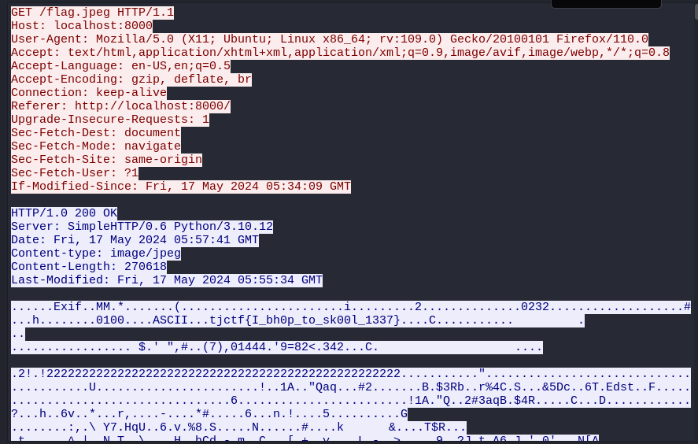

We're given a pcap file.
Grepping for `flag` on the pcap shows that there was a GET request made to `flag.jpeg` which is of interest to us.

```
└─$ strings capture.pcap | grep flag
<li><a href="flag.jpeg">flag.jpeg</a></li>
GET /flag.jpeg HTTP/1.1
```

Open the pcap in Wireshark, follow the HTTP stream for the request, and we get the flag.



Flag: `tjctf{I_bh0p_to_sk00l_1337}`