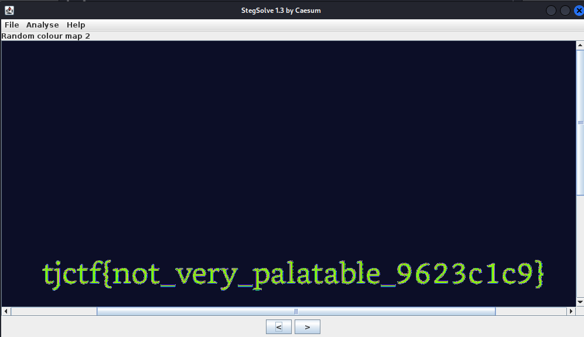

We're given `flag.jpeg`.
`file` confirms that the file is indeed a `jpeg`.
`strings` did not return anything of interest.

Throw the image into StegSolve, fiddle around with the colour map, and you'll get the flag.

