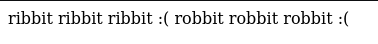
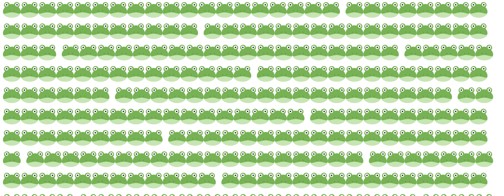
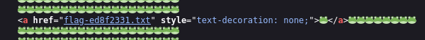

Visiting the website, we just get a message.

Looking at `robots.txt`, we find another page at `/secret-frogger-78570618/`

We will find a link to the flag in the HTML.

Flag: `tjctf{fr0gg3r_1_h4rdly_kn0w_h3r_3e1c574f}`